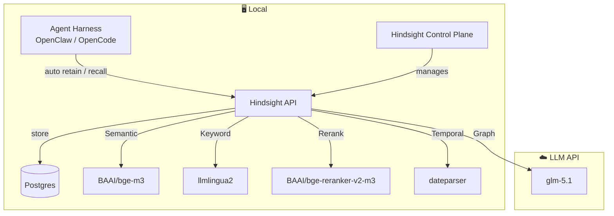

# Al Jal Ttak Kkal Sen

"Al Jal Ttak Kkal Sen" is the Korean alphabet rendering of 알잘딱깔센 — roughly, "doing the right thing, cleanly, with good sense."

## Architecture



## Setup

```sh
uv run setup
```

### .env

See `.env.example`

### Run

Hindsight API:
```sh
tmux new -s hs-api 'uv run hs-api'
```

View logs: `tmux capture-pane -t hs-api -p -S -500`

Hindsight Control Plane:
```sh
tmux new -s hs-web 'uv run hs-web'
```
